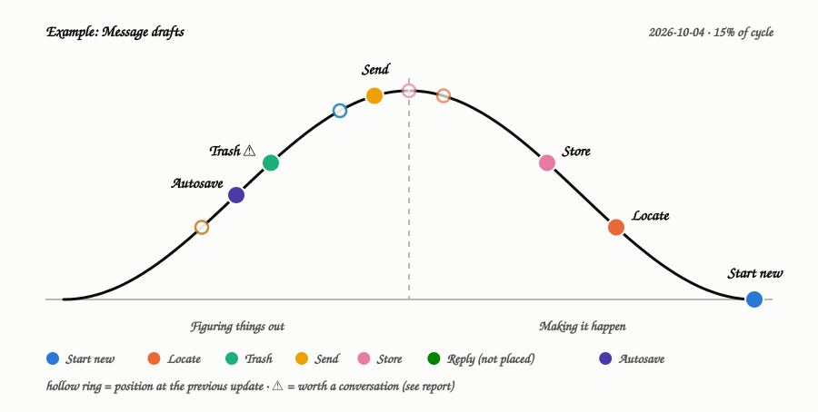
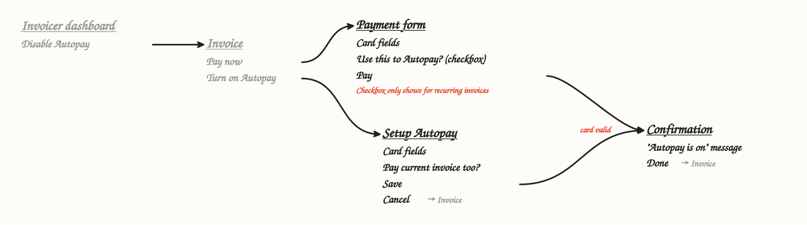
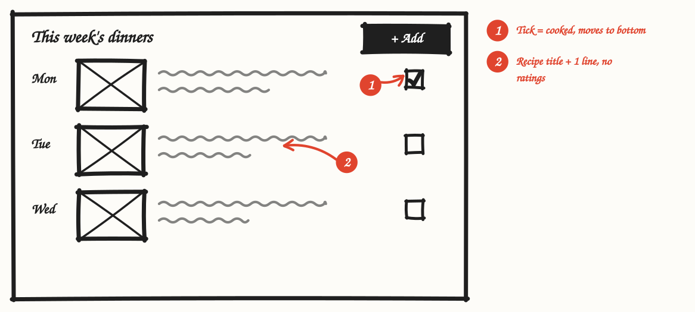

# Shape Up skills for Claude

Eight [Agent Skills](https://docs.claude.com/en/docs/agents-and-tools/agent-skills/overview) that teach Claude to work the way Basecamp's [Shape Up](https://basecamp.com/shapeup) describes: shape raw ideas into bounded pitches, bet on them in six-week cycles, and build them with scopes, hill charts and scope hammering.

Three skills cover the method itself. Five more do the hands-on work the method relies on: drawing, tracking, checking code, and running it all in Linear.



## The skills

| Skill | Part of the book | What Claude does with it |
|---|---|---|
| [`shape-up-shaping`](skills/shape-up-shaping/SKILL.md) | Ch. 2–6 | Turns a raw idea into a pitch: appetite, narrowed problem, elements, rabbit holes, no-gos. |
| [`shape-up-betting`](skills/shape-up-betting/SKILL.md) | Ch. 7–9, 15, appendices | Runs the betting table, protects cycles and cool-down, applies the circuit breaker, handles bugs and feedback without a backlog. |
| [`shape-up-building`](skills/shape-up-building/SKILL.md) | Ch. 10–14 | Hands over the project, gets one piece done, maps scopes, hammers scope, decides when to stop. |
| [`breadboard`](skills/breadboard/SKILL.md) | Ch. 4 | Writes UI flows as places → affordances → connections and draws them as a hand-drawn diagram. |
| [`fat-marker-sketch`](skills/fat-marker-sketch/SKILL.md) | Ch. 4, 6 | Draws deliberately rough UI sketches with numbered callouts, optionally over a screenshot. |
| [`hill-chart`](skills/hill-chart/SKILL.md) | Ch. 13 | A live hill chart page the team drags dots on, plus snapshots and a "status without asking" report that flags stuck scopes. |
| [`shape-up-risk-scan`](skills/shape-up-risk-scan/SKILL.md) | Ch. 5 | Checks a pitch against a real codebase for rabbit holes before you bet: where each element lands, missing precedent, caching/data/permission traps. |
| [`shape-up-linear`](skills/shape-up-linear/SKILL.md) | All | Runs the whole process in Linear: pitches as projects, scopes as milestones, `~` nice-to-haves, hill-chart project updates, the circuit breaker at cycle end. |

### How they fit together

```
raw idea ─► shape-up-shaping ──► pitch ──► shape-up-betting ──► bet ──► shape-up-building ──► shipped (or cancelled)
              │  breadboard          │ risk-scan                 │          │  hill-chart
              │  fat-marker-sketch   │                           │          │
              └──────────────────────┴──── shape-up-linear records each step in Linear ───┘
```

## Examples

| Breadboard | Fat marker sketch |
|---|---|
|  |  |

[Risk scan report](examples/risk-scan.md): a sample pitch checked against Basecamp's open-source [Campfire](https://github.com/basecamp/once-campfire). It found that same-device drafts already existed and that the obvious place to store drafts would break sidebar caching.

## Structured data, not pictures

Every visual these skills produce comes with its data:

- A `.json` file next to each PNG/SVG/report, which is the source of truth. (The examples here are SVGs; the skills also write PNGs.)
- The same JSON embedded in the file itself: SVG `<metadata id="shapeup-data">`, PNG text chunk `shapeup-data`, or an HTML comment in the Markdown report.

Each helper has a `read_data(path)` function, so Claude reads a sketch, breadboard, hill chart or scan back as data and never has to read an image. Edit by rebuilding from the data, then re-rendering. Some apps strip image metadata on upload, so keep the `.json` with the image.

## Install

**Claude apps (claude.ai, desktop):** zip a skill's folder (for example `skills/hill-chart/`) and upload it in Claude's Skills settings. Repeat for each skill you want.

**Claude Code:** copy the folders into your skills directory:

```sh
git clone https://github.com/rhyslawsn/shape-up-skills
cp -r shape-up-skills/skills/* ~/.claude/skills/
```

Each skill is a single `SKILL.md`. The helpers (`fatmarker.py`, `breadboard.py`, `hillchart.py`, `riskscan.py`) are embedded in their skill, and Claude writes them out when needed. That keeps each skill self-contained and in one place.

### What the helpers need

| Skill | Needs |
|---|---|
| fat-marker-sketch, breadboard, hill-chart | Python 3, Pillow, Playwright + Chromium (for PNGs), npm (fetches the Kalam handwriting font once) |
| breadboard | Graphviz `dot` (falls back to a Mermaid file without it) |
| hill-chart (live page) | A claude.ai published Artifact with the `db` capability |
| shape-up-risk-scan | Python 3, ripgrep (`rg`), git |
| shape-up-linear | The Linear connector |

## Tests

`tests/run_skill_code.py` checks every skill's frontmatter, extracts the helper code from each `SKILL.md` exactly as written, and runs the examples. It also checks that the data round-trips through the images and that the live hill chart page's script parses. CI runs it on every push.

```sh
python tests/run_skill_code.py
```

## Credits

Built from [Shape Up: Stop Running in Circles and Ship Work that Matters](https://basecamp.com/shapeup) by Ryan Singer (Basecamp). The skills summarise and apply its ideas, with short quotes. Read the book; it's free online. Not affiliated with or endorsed by Basecamp/37signals.

## License

MIT for the skills and code in this repo (see [LICENSE](LICENSE)). The book itself is © Basecamp.
